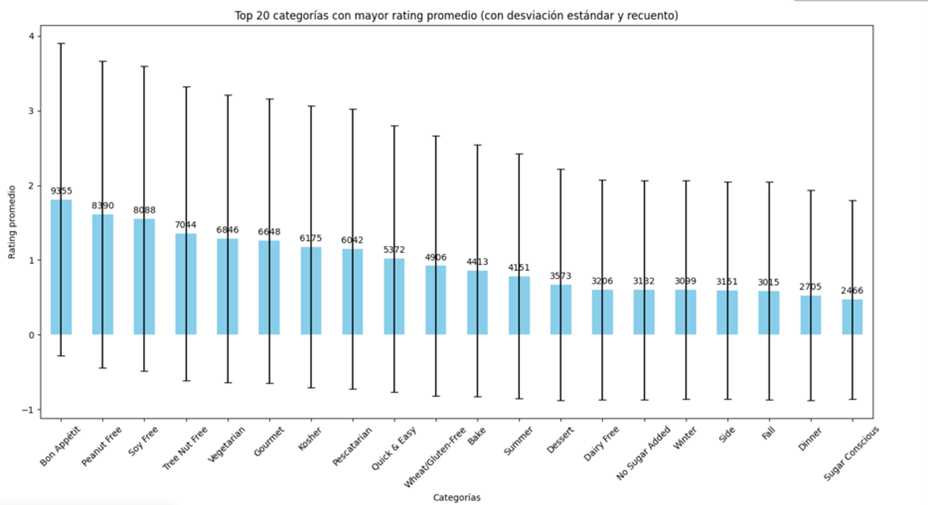
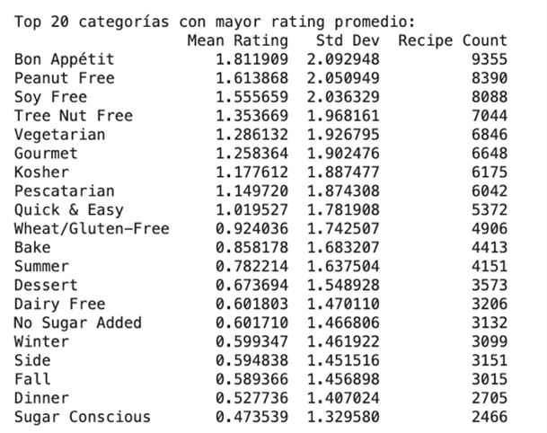
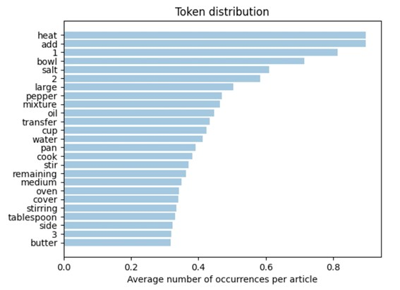
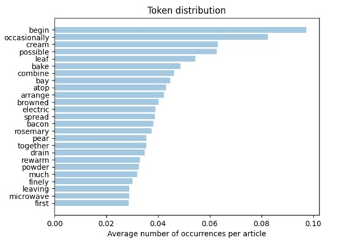
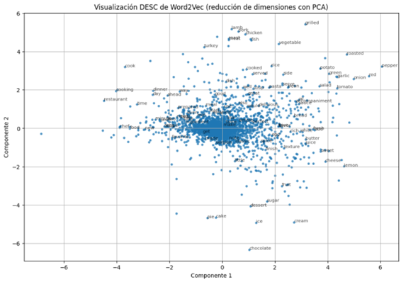
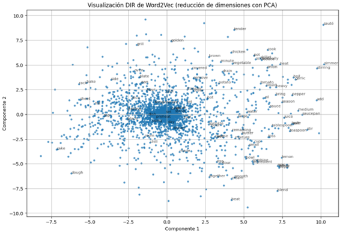

# Proyecto Final

## Tratamiento de Datos

### Máster de Ingeniería de Telecomunicación

---

### 1. Análisis de Variables de Entrada
El conjunto de datos analizado contiene información detallada de 20.130 recetas de cocina, estructurado en variables textuales y numéricas. El objetivo principal del trabajo es abordar un problema de regresión para predecir la variable `rating`, que representa la valoración otorgada por los usuarios.

#### 1.1 Análisis de las Variables Numéricas

#### Matriz de Correlación

Para analizar la relación entre estas variables numéricas y la variable objetivo `rating`, se ha realizado una matriz de correlación. Los resultados obtenidos indican que existe una fuerte correlación entre las variables nutricionales: por ejemplo, `fat` y `sodium` presentan un valor de correlación cercano a 0.99, lo que sugiere una dependencia lineal muy alta entre estas características. Del mismo modo, `protein` y `calories` también muestran correlaciones moderadas entre sí, con valores alrededor de 0.7.

#### Relación con la Variable Objetivo

Sin embargo, al analizar la relación de estas variables con `rating`, se observa que la correlación es extremadamente baja, con valores cercanos a 0.007. Esto sugiere que las características nutricionales no tienen una influencia significativa en la predicción de la valoración de las recetas.

  

#### 1.2 Análisis variables textuales

El siguiente paso es analizar si las variables textuales ofrecen información relevante para la predicción de la variable rating. Para este análisis se deben implementar técnicas de procesamiento del lenguaje natural (NLP), como la vectorización mediante TF-IDF y Word2Vec, así como embeddings contextuales basados en modelos de tipo Transformer como BERT. La combinación de estas representaciones nos permitirá analizar cómo el contenido textual influye en la valoración de las recetas.

En cuanto a la variable categories, esta variable de entrada se basa en etiquetas discretas y predefinidas, por lo que se ha optado por utilizar la técnica MultiLabelBinarizer en lugar de métodos como TF-IDF o Word2Vec, los cuales están diseñados para procesar texto libre y extraer representaciones numéricas basadas en frecuencias o contexto.

En este análisis se ha visualizado la relación entre la variable de salida rating y algunas de las categorías presentes en la variable categories. Los resultados muestran que las categorías tienen un impacto significativo en la valoración de las recetas. El gráfico de las 20 categorías con mayor rating promedio revela que unas pocas categorías, como "Bon Appétit", "Peanut Free" y "Soy Free", obtienen valoraciones considerablemente más altas, con ratings promedio superiores a 1.5. Además, el alto número de recetas en estas categorías (por ejemplo, 9355 recetas en "Bon Appétit") sugiere que son representativas y relevantes en el conjunto de datos. Al mismo tiempo, se observan categorías con ratings más bajos presentan valores promedio inferiores a 0.6. Estas diferencias en los ratings promedio indican que las categorías pueden capturar patrones importantes en los datos. Aun teniendo alta variabilidad, la influencia general de las categorías en las valoraciones indica que actúan como indicadores relevantes para predecir la variable rating.

  
  

---

### 2. Implementación de un pipeline para el preprocesado de los textos. 
Se ha implementado un pipeline de preprocesado de textos con el objetivo de preparar los datos textuales para su posterior análisis y representación vectorial. Se han realizado en una serie de transformaciones aplicadas al texto, utilizando la librería NLTK. 

Se ha creado una función de preprocesado llamada preprocess_text, donde se ha realizado lo siguiente:

Tokenización:
-	Se utiliza la función word_tokenize de NLTK para dividir el texto en tokens individuales (palabras). Este paso permite trabajar con cada palabra de forma aislada.

Normalización del texto:
-	Se convierten todos los tokens a minúsculas para evitar duplicidades causadas por diferencias en mayúsculas y minúsculas.
-	Se eliminan caracteres especiales y se filtran únicamente tokens alfanuméricos mediante una comprobación con isalnum().

Eliminación de números:
-	Al analizar la columna directions, se ha observado que muchas recetas presentan los pasos numerados, utilizando un formato como "1.", "2.", etc.. Dado que esta información no aporta relevancia al proceso de tokenización ni al análisis del contenido del texto, se ha decidido descartar estos tokens durante el preprocesado. Para ello, se aplicó una expresión regular que identifica y elimina los números seguidos de un punto,

Eliminación de Stopwords:
-	Las stopwords (palabras muy frecuentes como "the", "is", "and") se eliminan utilizando una lista predefinida en inglés proporcionada por NLTK. 

Lematización:
-	Finalmente, se aplica la lematización mediante WordNetLemmatizer, que reduce las palabras a su forma base o raíz. Este paso ayuda a agrupar palabras con un significado similar y reducir la dimensionalidad del texto.

Además, se comprueba si la entrada es una lista (como puede ser el caso de textos tokenizados previos) y, en ese caso, se unen los elementos en una única cadena de texto. La salida de esta función es una lista de tokens limpios y lematizados, que pueden ser utilizados posteriormente en técnicas de vectorización como TF-IDF, Word2Vec, o embeddings contextuales.

---

### 3. Representación vectorial de los documentos mediante tres procedimientos diferentes:

TF-IDF
#### 3.1 TF-IDF

Una vez preprocesados los textos, se utiliza el modelo Bag of Words (BoW) para construir un diccionario de tokens. Este diccionario asigna a cada término único del corpus un identificador numérico, lo que permite representar los textos como combinaciones de estos identificadores y sus frecuencias de aparición en los documentos. 

Como no todos los términos son igualmente útiles para el análisis se aplican filtros al diccionario: se eliminan los términos que aparecen en muy pocos documentos (menos de un umbral definido, como 10), ya que probablemente no aportan información generalizable, y aquellos que aparecen en una proporción demasiado alta del corpus (más del 75% de los documentos), ya que suelen ser palabras genéricas sin valor distintivo.

Después de este filtrado, se aplica el modelo TF-IDF) sobre la representación BoW. TF-IDF pondera cada término según su frecuencia en un documento específico y su frecuencia inversa en el corpus completo. 

Los términos comunes en todo el corpus, como palabras de uso cotidiano, recibiran menos peso, mientras que los términos que son más específicos para un documento individual se consideren más importantes. El resultado es una representación numérica de los textos en forma de vectores ponderados, que reflejan la relevancia relativa de cada término en el contexto del corpus.

Se ha representado en un gráfico la distribución de tokens para la columna desc: 

  

La distribución de tokens para la columna directions: 

  

#### 3.2 WORD2VEC

El proceso de vectorización con Word2Vec consiste en transformar los textos preprocesados en representaciones numéricas multidimensionales que capturan las relaciones semánticas entre palabras. Para ello, se entrena un modelo Word2Vec con los textos de descripciones, direcciones y categorías utilizando parámetros como un tamaño de vector de 100 dimensiones (vector_size=100), una ventana de contexto de 5 palabras (window=5) y un mínimo de 5 apariciones por palabra (min_count=5). 

Una vez entrenado, el modelo asigna a cada palabra un vector numérico que refleja su relación con otras palabras en función de su contexto. Para representar documentos completos, se calcula el vector promedio de las palabras que aparecen en el texto, ignorando aquellas que no están en el vocabulario del modelo. Si no hay palabras válidas en el texto, se asigna un vector de ceros.

Posteriormente, se extraen los vectores de las palabras del vocabulario y se aplica una reducción de dimensiones mediante PCA (Análisis de Componentes Principales), que permite reducir los vectores de 100 dimensiones a 2 componentes principales para visualización. Esta transformación facilita representar gráficamente las palabras en un plano 2D, donde se observan agrupaciones que reflejan las relaciones semánticas aprendidas por Word2Vec

  

  

#### 3.3 BERT

---

### 4. Entrenamiento y evaluación de modelos de regresión

### 4.1 Red Neuronal

### 4.1.1 Entrenamiento y evaluación con vectorización TF-IDF

### 4.1.2 Entrenamiento y evaluación con vectorización WORD2VEC

### 4.1.3 Entrenamiento y evaluación con vectorización BERT

### 4.2 RandomForest

Como primer paso en la implementación del modelo, se dividió el conjunto de datos de entrada (X) y la columna de salida ratings (Y) en subconjuntos de entrenamiento y prueba utilizando train_test_split. Se ha asignado el 80% de los datos al conjunto de entrenamiento y el 20% restante al conjunto de prueba, con el objetivo de mejorar la evaluación del modelo al evaluar conjunto de datos no vistos durante el entrenamiento.

Posteriormente, el conjunto de entrenamiento fue subdividido en un conjunto de entrenamiento y un conjunto de validación, asignando el 70% de los datos originales de entrenamiento para entrenamiento y el 30% para validación. Este conjunto de validación se utiliza para evaluar el rendimiento del modelo y seleccionar los mejores hiperparámetros garantizando así que el modelo no se ajuste en exceso al conjunto de entrenamiento.

Por tanto, para este modelo se ha realizado una búsqueda de hiperparámetros utilizando GridSearchCV con el objetivo de optimizar el rendimiento del algoritmo Random Forest y encontrar la combinación de parámetros que minimizara el error en la predicción. Existen varios hiperparámetros que afectan la capacidad de generalización y ajuste, como el número de árboles, la profundidad máxima del árbol, el número mínimo de muestras requeridas para dividir un nodo, y el número mínimo de muestras por hoja y max_features, que controla la cantidad de características consideradas en cada división.

Los mejores hiperparámetros encontrado fueron: n_estimators=500, max_depth=50, min_samples_split=2, min_samples_leaf=1 y max_features='sqrt'. Con estos valores óptimos, se entrenó un modelo final sobre el conjunto completo de entrenamiento (excluyendo la validación) para maximizar su capacidad de generalización. 

Posteriormente, se evaluó este modelo final en el conjunto de prueba.

### 4.2.1 Entrenamiento y evaluación con vectorización TF-IDF

### 4.2.2 Entrenamiento y evaluación con vectorización WORD2VEC

### 4.2.3 Entrenamiento y evaluación con vectorización BERT

