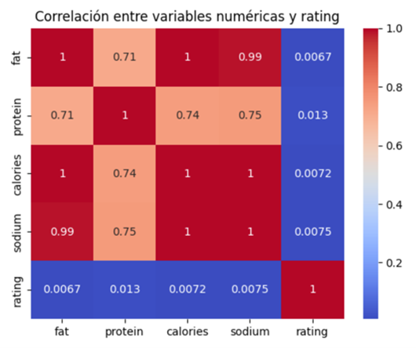

# Proyecto Final

## Tratamiento de Datos

### Máster de Ingeniería de Telecomunicación

---

### 1. Análisis de Variables de Entrada
El conjunto de datos analizado contiene información detallada de 20.130 recetas de cocina, estructurado en variables textuales y numéricas. El objetivo principal del trabajo es abordar un problema de regresión para predecir la variable `rating`, que representa la valoración otorgada por los usuarios.

#### 1.1 Análisis de las Variables Numéricas

#### Matriz de Correlación

Para analizar la relación entre estas variables numéricas y la variable objetivo `rating`, se ha realizado una matriz de correlación. Los resultados obtenidos indican que existe una fuerte correlación entre las variables nutricionales: por ejemplo, `fat` y `sodium` presentan un valor de correlación cercano a 0.99, lo que sugiere una dependencia lineal muy alta entre estas características. Del mismo modo, `protein` y `calories` también muestran correlaciones moderadas entre sí, con valores alrededor de 0.7.

#### Relación con la Variable Objetivo

Sin embargo, al analizar la relación de estas variables con `rating`, se observa que la correlación es extremadamente baja, con valores cercanos a 0.007. Esto sugiere que las características nutricionales no tienen una influencia significativa en la predicción de la valoración de las recetas.

  

